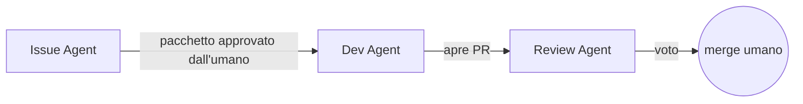

# Fabric Agentic

Kit riutilizzabile per far lavorare tre agenti AI su un ciclo di delivery Microsoft Fabric —
requisiti, implementazione, review — con merge sempre umano. Questo documento è il punto di
partenza compatto: per ogni sezione trovi il file che approfondisce.

## Cosa fa, in una frase

Tre agenti (**Issue**, **Dev**, **Review**), ciascuno con la propria identità applicativa, attivati
da un dispatcher **deterministico e senza LLM** che li sveglia solo quando c'è lavoro. Il modello
non fa polling: lo fa uno script. A sistema fermo il costo è zero.



| Agente | Fa | Non fa mai |
|---|---|---|
| **Issue** | Trasforma una richiesta in un pacchetto di lavoro da approvare | Creare un work item senza approvazione umana |
| **Dev** | Implementa un ticket approvato, apre la PR | Merge su `main` |
| **Review** | Vota una PR contro una checklist chiusa | Scrivere codice di feature |

## Avvio rapido

```
python -m fabric_agentic doctor      # cosa è pronto, cosa manca, comando di avvio di ognuno
python -m fabric_agentic console     # la stessa vista come pagina locale (sola lettura)
```

Poi, in tre terminali distinti, i comandi che `doctor` stampa già completi di percorsi:

```
python -m scripts.issue_dispatcher  --config ... --state ... --tasks ... --poll
python -m scripts.dev_dispatcher    --config ... --state ... --tasks ... --log ... --poll
python -m scripts.review_dispatcher --config ... --state ... --tasks ... --poll
```

Prima volta: aggiungi `--once --dry-run` a un comando per vedere cosa raccoglierebbe senza avviare
sessioni né scrivere su GitHub. Dettagli e layout canonico: [docs/technical/12-console-e-avvio.md](docs/technical/12-console-e-avvio.md).

## Struttura del repository

```
fabric_agentic/   core riutilizzabile — nessuna dipendenza, nessun valore di tenant/cliente
scripts/          perimetro operativo — dispatcher, rail, publisher (può importare il core)
profiles/         un profilo di istanza per progetto/cliente, senza segreti
agents/           istruzioni degli agenti, versionate come codice
docs/             requisiti, decisioni (ADR), documentazione tecnica e funzionale
```

Il core non importa mai `scripts`: un test lo impone ([ADR-0015](docs/adr/ADR-0015-pacchetto-riutilizzabile-alla-radice.md)).
L'elenco dei connector ammessi vive solo in `fabric_agentic/connectors.py` ([ADR-0016](docs/adr/ADR-0016-registry-dei-connector.md)).

## Portare il flusso su un cliente o un collega

```
python -m fabric_agentic init     --directory profiles/<cliente> --project-slug <cliente>
python -m fabric_agentic validate --config profiles/<cliente>/instance.json
python -m fabric_agentic render   --config profiles/<cliente>/instance.json --output .generated
```

`init` genera un profilo (`instance.json`, senza segreti: solo placeholder `REPLACE_WITH_*`) e una
`CHECKLIST.md` con i passaggi umani — identità, permessi, Fabric, Git, secret store — da spuntare
prima del primo ticket. È ripetibile: rilanciato non sovrascrive file già modificati, a meno di
`--force`. Il resto del bootstrap — identità dedicate, permessi, protezione del ramo principale —
resta oggi una checklist eseguita da un umano, non ancora automatizzabile:
[docs/functional/06-onboarding-nuovo-cliente.md](docs/functional/06-onboarding-nuovo-cliente.md).

Per i colleghi che preferiscono un form, la pagina statica in `onboarding/` genera lo stesso
`instance.json`: nessun backend, nessuna API autenticata e nessun secret store. Il workflow
`publish-onboarding-pages.yml` costruisce schema e starter direttamente dal package e pubblica
l'artifact su GitHub Pages dopo il merge su `main`.

## Stato e limiti noti

| | Stato |
|---|---|
| Connector registrati | `crm_dataverse` (incrementale), `file` (solo carico completo) |
| Runtime dei dispatcher | Locale, tre terminali. Target: event-driven su runner self-hosted ([ADR-0017](docs/adr/ADR-0017-runtime-agenti-event-driven.md)) |
| **Identità di inferenza** | **Bloccante**: Issue, Dev e Review girano oggi sullo stesso Claude Code sotto l'account personale dell'operatore, non un'identità aziendale. Vedi `CONTEXT.md` e PRD Q-13 |
| Bootstrap di un collega | `python -m fabric_agentic init` genera profilo e checklist; identità e permessi restano manuali |
| Interfaccia web per non tecnici | Pagina statica `onboarding/`, pubblicata su GitHub Pages |

## Documentazione, in ordine di lettura

| # | Documento | Contenuto |
|---|---|---|
| 1 | [CONTEXT.md](CONTEXT.md) | Glossario e stato reale dell'ambiente. Letto dagli agenti a ogni sessione |
| 2 | [AGENTS.md](AGENTS.md) | Disciplina di lavoro: GitHub Flow, changelog, confine core/operativo |
| 3 | [docs/technical/01-architettura-agenti.md](docs/technical/01-architettura-agenti.md) | Anatomia dei tre agenti, asimmetria dei permessi |
| 4 | [docs/technical/02-dispatcher.md](docs/technical/02-dispatcher.md) | Trigger, ciclo continuo, verifiche sul campo |
| 5 | [docs/technical/12-console-e-avvio.md](docs/technical/12-console-e-avvio.md) | Come si accende oggi |
| 6 | [docs/technical/06-contratto-connettore.md](docs/technical/06-contratto-connettore.md) | Come si aggiunge una sorgente |
| 7 | [docs/functional/06-onboarding-nuovo-cliente.md](docs/functional/06-onboarding-nuovo-cliente.md) | Come si propaga a un nuovo cliente |
| 8 | [docs/prd/PRD-agentic-cicd-fabric.md](docs/prd/PRD-agentic-cicd-fabric.md) | Visione, scope, domande aperte |
| — | [docs/adr/](docs/adr/) | Ogni decisione che vale la pena non ridiscutere |

Indice completo della documentazione tecnica: [docs/technical/README.md](docs/technical/README.md).

## Sviluppo

```
python -m pytest -q
python -m fabric_agentic doctor --config profiles/template/instance.json
```

Nessuno step di installazione richiesto: il core è eseguibile subito dopo il clone. Ogni modifica
segue GitHub Flow — branch dedicato, PR verso `main`, merge umano — mai un commit diretto su `main`.
