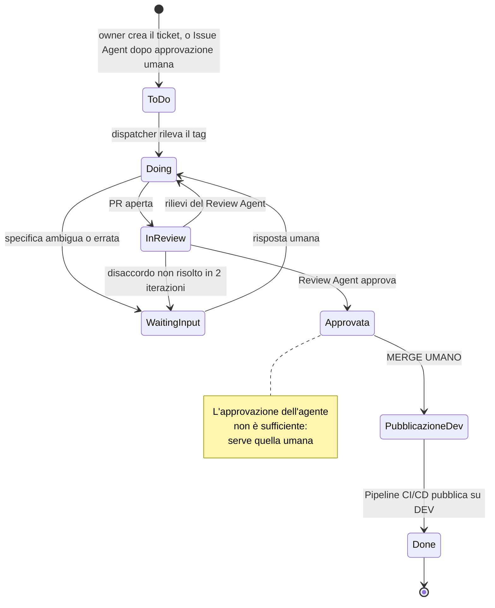

# 01 — Ciclo di vita del ticket

> Descrive il percorso completo di una richiesta, dallo scrivere il ticket al merge.
> È il documento di riferimento per capire **chi fa cosa e dove si ferma**.

---

## 1. Principio di fondo

L'umano interviene in **due soli momenti**: quando approva il ticket e quando preme merge.
Il ticket può essere redatto dall'Issue Agent, ma **non diventa esecutivo senza approvazione
umana**. Tutto ciò che sta in mezzo è automatico — ma **niente di ciò che sta in mezzo può
raggiungere `main` da solo**.

Quando il ticket nasce da materiale grezzo locale, la preparazione può avvenire prima in una
sessione Issue Agent dentro VS Code/chat. Quel passaggio produce il pacchetto, ma non sostituisce
il cancello operativo: il pacchetto o la sintesi devono finire in una GitHub Issue e l'umano deve
approvarli prima di applicare il tag del Dev Agent.

Corollario operativo: se ti accorgi di dover intervenire tecnicamente durante il ciclo (aprire
un workspace, correggere una pipeline a mano, rilanciare un carico), **non è un contrattempo:
è un difetto del sistema**. Va tracciato come tale, non assorbito con una correzione manuale
silenziosa.

---

## 2. Gli attori e i loro limiti

| Attore | Può | Non può |
|---|---|---|
| **Owner umano** | Approvare il pacchetto di lavoro, scrivere o approvare il ticket, rispondere ai blocchi, approvare, mergiare, promuovere verso prod | — |
| **Issue Agent** | Orchestrare `karl` e `ralph`, produrre il pacchetto di lavoro e i ticket proposti | Creare work item senza approvazione umana, scrivere codice di feature, accedere a Fabric |
| **Dev Agent** | Creare branch e feature workspace tramite rail, sviluppare item Fabric in Git, testare nel feature workspace, aggiornare doc, aprire PR, rispondere ai rilievi | Mergiare, pushare su `main`, scrivere direttamente su Fabric, modificare i propri permessi |
| **Review Agent** | Leggere il diff, verificare la checklist, commentare, votare | Scrivere codice di feature, accedere a Fabric, mergiare |
| **Dispatcher** | Rilevare i trigger e avviare una sessione | Prendere decisioni: non usa LLM |

---

## 3. Stati del work item

| Stato | Significato | Chi lo imposta |
|---|---|---|
| **To Do** | Ticket scritto. Con il tag dell'agente, è pronto per la presa in carico | Owner, o Issue Agent dopo approvazione umana |
| **Doing** | Sessione dell'agente in corso o PR aperta e in review | Dev Agent |
| **Doing** + tag `waiting-input` | L'agente è bloccato e ha posto una domanda sul ticket | Dev Agent |
| **Done** | PR mergiata su `main` | Owner (al merge) |

**Regola**: un ticket con tag `waiting-input` non viene ripreso finché non arriva una risposta umana.
L'agente non "riprova più tardi" e non tira a indovinare.

---

## 4. Il flusso, passo per passo

### Fase 1 — Presa in carico

1. Il work item entra in *To Do* con il tag riservato al Dev Agent: lo crea l'owner, oppure
   l'Issue Agent dopo l'approvazione umana del pacchetto di lavoro.
2. Il dispatcher, in polling, rileva il ticket entro un ciclo (~30 secondi).
3. Viene avviata una **sessione nuova e senza memoria** del Dev Agent.
4. L'agente sposta il ticket in *Doing*.

> Perché una sessione nuova ogni volta: lo stato non vive nella memoria del modello, vive nel
> tracker e in Git. Una sessione interrotta si può rilanciare senza conseguenze.

### Fase 2 — Contesto

5. L'agente aggiorna la propria copia locale del repo soluzione **e** della knowledge base.
6. Legge `CONTEXT.md` e i runbook pertinenti **prima** di toccare qualsiasi cosa.

> Questo passo non è negoziabile né saltabile: è ciò che impedisce all'agente di inventarsi
> convenzioni proprie.

### Fase 3 — Isolamento

7. Crea il branch feature, con nome derivato dall'ID del work item.
8. Crea il **feature workspace Fabric**, anch'esso con nome derivato dall'ID.
9. Aggiunge l'owner come amministratore del workspace.
10. Connette il workspace al branch e sincronizza.

> L'owner è sempre amministratore: se qualcosa va storto, deve poter guardare dentro senza
> chiedere permesso a nessuno.

### Fase 4 — Implementazione e verifica

11. Implementa in Git l'artefatto richiesto: data pipeline, notebook, Dataflow, Spark Job Definition,
    Lakehouse/Warehouse, Mirroring (se supportato), semantic model o report; rispetta naming e cartelle.
12. La pipeline CI/CD materializza l'artefatto nel feature workspace e **esegue realmente** il carico o la validazione.
13. Verifica gli esiti: controlli di qualità dato, conteggi di audit, esito della scrittura.

**Se la verifica fallisce**, l'agente distingue due casi:

| Causa | Comportamento |
|---|---|
| Errore proprio (implementazione sbagliata) | Corregge e ripete, entro un numero limitato di tentativi |
| Specifica ambigua, errata o incompleta | **Si ferma**, aggiunge il tag `waiting-input`, commenta il blocco con l'evidenza, termina la sessione |

Vedi [05 — Protocollo di escalation](05-protocollo-escalation.md).

### Fase 5 — Documentazione

14. Aggiorna la documentazione impattata dalla modifica.
15. Aggiunge la voce in `CHANGELOG.md` sotto `[Unreleased]`.

> La documentazione si aggiorna **nella stessa PR**, non "dopo". Una PR senza aggiornamento
> documentale pertinente è respinta in review.

### Fase 6 — Pull request

16. Apre la PR, allegando l'**evidenza dell'esecuzione**: esito, conteggi, identificativo del run.
17. Il dispatcher del Review Agent rileva la PR secondo il trigger configurato; non serve assegnare
    manualmente un revisore né applicare un label.
18. La sessione termina. Il dispatcher torna in polling.

### Fase 7 — Review indipendente

19. Il dispatcher del Review Agent rileva la PR e avvia una sessione.
20. Il Review Agent verifica il diff **sulla propria copia del repo**: non si fida della
    descrizione della PR.
21. Percorre la [checklist chiusa](04-checklist-review.md) e produce un esito per ogni voce.
22. Se ci sono rilievi, commenta e **non approva**. Altrimenti approva.

> Il Review Agent non ha accesso a Fabric. Giudica la verità di Git e le evidenze allegate.
> Se un'evidenza manca, è un rilievo: non può andarsela a prendere.

### Fase 8 — Iterazione

23. I commenti sulla PR risvegliano il Dev Agent, che corregge e ripubblica.
24. La nuova push risveglia il Review Agent per la re-review.
25. **Dopo due iterazioni senza convergenza, il caso escala all'owner.**

### Fase 9 — Chiusura

26. L'owner rivede l'esito, approva e **merge** (unica azione di merge del sistema).
27. La pipeline CI/CD, ancorata a `main`, pubblica automaticamente il commit mergiato su `ws_<progetto>_dev`.
28. Il branch viene chiuso e il feature workspace rimosso dallo Sweep schedulato.
29. Il ticket passa in *Done* quando la pubblicazione su DEV è riuscita.

---

## 5. Diagramma degli stati

---

## 6. Cosa NON succede mai

Elenco volutamente esplicito, perché sono le domande che riceverai in demo:

- Un agente **non** mergia. Mai, per nessuna tipologia di modifica.
- Un agente **non** promuove verso test o produzione.
- Gli agenti **non** si parlano direttamente: ogni scambio passa da un commento tracciabile.
- Il Dev Agent **non** apre PR su codice che non ha eseguito.
- Il Review Agent **non** corregge il codice che sta revisionando.
- Nessun agente gira con un'identità umana: ognuno ha il proprio service principal.
- Il sistema **non** consuma token quando non c'è lavoro.
