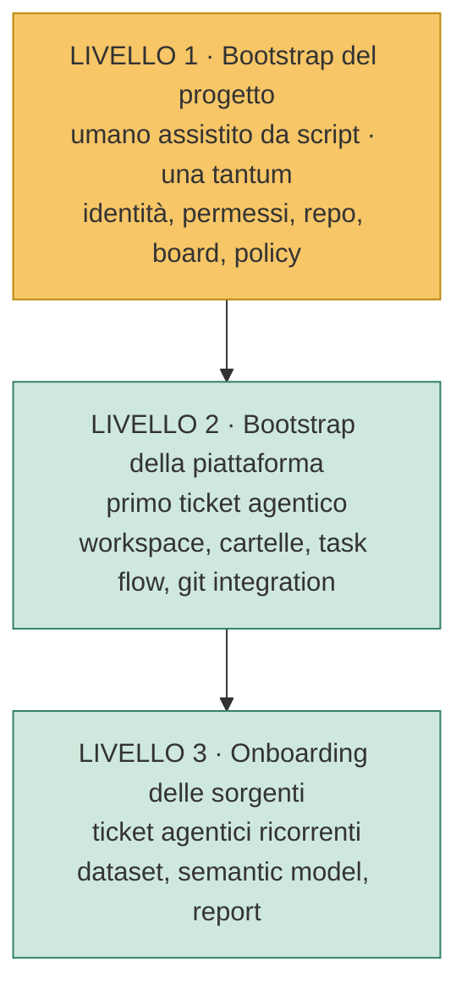

# 06 — Onboarding di un nuovo cliente

> Risponde alla domanda: *"arriva un nuovo cliente — apriamo un progetto, apriamo un task e via?"*
>
> **Risposta breve: no.** Serve un gradino umano prima, e non è un limite temporaneo del sistema:
> è una scelta di sicurezza deliberata.

---

## 1. Perché non basta aprire un task

Due ragioni, entrambe strutturali.

### 1.1 Il problema dell'uovo e della gallina

Il dispatcher è in polling **su un progetto specifico**. Per aprire un task che dice "crea il
progetto", il progetto dovrebbe già esistere. Il primo anello della catena non può che essere
esterno alla catena.

### 1.2 L'escalation di privilegi

Il gradino umano non serve solo a rompere la circolarità. Serve soprattutto a questo:

> **Un agente non può creare la propria identità, né assegnarsi i propri permessi.**

Se il Dev Agent potesse creare service principal e attribuire permessi, l'intero modello di
sicurezza sarebbe decorativo: qualunque limite gli avessimo imposto, potrebbe rimuoverlo.
La creazione delle identità e l'assegnazione dei permessi restano fuori dal perimetro degli
agenti **per sempre**, non solo in fase 1.

---

## 2. I tre livelli di onboarding

| Livello | Chi | Frequenza | Automatizzabile |
|---|---|---|---|
| **1 — Bootstrap del progetto** | Umano, con script di supporto | Una volta per cliente | Parzialmente: lo script fa il lavoro, l'umano autorizza |
| **2 — Bootstrap della piattaforma** | Dev Agent | Una volta per cliente | Sì, interamente |
| **3 — Onboarding delle sorgenti** | Dev Agent | Continuo | Sì, interamente |

Solo il **Livello 1** richiede presenza umana. Ed è l'unico che si paga una volta sola.

---

## 3. Livello 1 — Bootstrap del progetto

### 3.1 Cosa serve prima di iniziare

| Prerequisito | Note |
|---|---|
| Tenant con capacity Fabric attiva | Dimensionata sul carico previsto |
| Organizzazione Azure DevOps (o GitHub) | Il tracker su cui girerà il flusso |
| Tenant dell'organizzazione Azure DevOps | Coincide con il tenant Fabric delle identità agentiche, oppure la migrazione di directory è completata prima di aggiungere gli SP |
| Credenziale tecnica per il cliente | SP OIDC, SP con secret oppure utenza di servizio; scelta e autorizzazione sono umane |
| Nome progetto | Diventa il segmento variabile del naming (`ws_<progetto>_<ambiente>`) |
| Sottoscrizioni ai runtime degli agenti | Due vendor diversi, uno per ruolo |

### 3.2 Checklist di bootstrap

**Identità e permessi** *(richiede un amministratore del tenant)*

- [ ] Predisporre le identità del Dev Agent e del Review Agent nell'organizzazione AGIC, distinte dalla credenziale del cliente
- [ ] Associare l'organizzazione Azure DevOps al tenant Fabric che ospita le identità agentiche; per la sandbox è Agic Dev (`1cf6db06-3e00-48b6-a65c-be932526610e`)
- [ ] Scegliere una sola `ExecutionCredential` per il cliente: SP OIDC, SP con secret o utenza di servizio
- [ ] Se si usa utenza di servizio: verificare che MFA e Conditional Access permettano un uso non interattivo
- [ ] Custodire la credenziale o il suo riferimento in Azure Key Vault / secret store; l'agente non deve poterla leggere
- [ ] Assegnare alla `ExecutionCredential` i soli permessi necessari su workspace e sorgenti del cliente
- [ ] Creare il gruppo di sicurezza degli agenti e attivare gli switch di tenant necessari per le sole diagnosi consentite
- [ ] Verificare che il Dev Agent non abbia ruoli di scrittura Fabric né accesso diretto alle connessioni dati
- [ ] Verificare che il Review Agent **non** abbia alcun accesso a Fabric
- [ ] Registrare solo riferimenti al secret store — mai credenziali in file di configurazione

**Esito sandbox Agentic (2026-08-20)**

- Tenant Fabric: Agic Dev (`1cf6db06-3e00-48b6-a65c-be932526610e`)
- Sottoscrizione: `898b6a78-11dd-4e23-bf53-9e17f541d955`; capacity: `fabricalessiodev`
- Dev Agent: `fabric-agentic-dev-agent` (app ID `e74ca724-e306-4ff3-ae02-77ef7368e673`)
- Review Agent: `fabric-agentic-review-agent` (app ID `a6d3e2af-92e5-447a-bb1e-9a466e1bdaed`)
- Nessun secret, ruolo Fabric o credenziale tecnica sorgente è stato ancora assegnato.
- L'organizzazione Azure DevOps `alessioandriulo` deve ancora essere associata al tenant Agic Dev prima di aggiungere gli SP al tracker.

**Tracker**

- [ ] Creare il progetto e il repository della soluzione
- [ ] Creare il repository o lo spazio della knowledge base
- [ ] Configurare la board con gli stati previsti dal ciclo di vita
- [ ] Creare il tag riservato al Dev Agent
- [ ] Assegnare ai due service principal i permessi minimi previsti dal modello

**Protezione del ramo principale** *(il passo più importante dell'intero bootstrap)*

- [ ] Vietare il push diretto su `main` a **entrambi** gli agenti
- [ ] Richiedere la pull request per ogni modifica
- [ ] Rendere obbligatoria l'approvazione umana **in aggiunta** a quella del Review Agent
- [ ] **Verificare la policy provandola**: tentare un push con l'identità dell'agente e
      confermare che venga rifiutato

> L'ultimo punto non è pedanteria. Una policy configurata e mai verificata è una policy di cui
> non sai nulla. È il primo controllo che salterà, sotto pressione, e l'unico che non puoi
> permetterti di dare per buono.

**Knowledge base**

- [ ] Popolare `CONTEXT.md` con il nome progetto e le eventuali convenzioni specifiche
- [ ] Portare la documentazione funzionale nel nuovo progetto
- [ ] Generare la wiki dalla documentazione versionata

**Ambiente locale dell'operatore**

- [ ] Installare i due runtime agentici in ambienti di esecuzione separati
- [ ] Configurare i due dispatcher con i riferimenti al progetto
- [ ] Verificare che ciascun dispatcher si autentichi con **il proprio** service principal
- [ ] Avviare i dispatcher e confermare il polling a vuoto, senza consumo di token

### 3.3 Cosa è asset e cosa è specifico del cliente

La distinzione va tenuta netta, altrimenti l'asset smette di essere riusabile al secondo cliente.

| Riusabile (asset) | Specifico dell'istanza |
|---|---|
| Documentazione funzionale e runbook | Nome progetto, tenant, identificativi |
| Checklist di review | Sorgenti dati e loro configurazione |
| Istruzioni degli agenti | Credenziali e riferimenti al secret store |
| Contratto `ExecutionCredential` e rail diagnostico | Tipo concreto della credenziale e relativo riferimento nel secret store |
| Script deterministici | Dimensionamento della capacity |
| Framework metadata-driven e connettori | Convenzioni specifiche concordate col cliente |
| Convenzioni di naming (come schema) | Il valore del segmento `<progetto>` |

**Regola**: tutto ciò che è specifico dell'istanza vive in **un unico punto parametrico**. Se
per istanziare un nuovo cliente devi cercare e sostituire un nome in più file, l'asset è già
degradato.

---

## 4. Livello 2 — Bootstrap della piattaforma

Da qui in avanti è tutto agentico. Il primo ticket reale del nuovo cliente è:

> **"Crea i workspace DEV e PROD del progetto"**

Il Dev Agent:

1. crea i workspace secondo le convenzioni di naming;
2. crea la struttura a cartelle prevista per ogni layer;
3. predispone il task flow che rappresenta il flusso end-to-end;
4. configura la Git integration verso il repository della soluzione;
5. documenta l'ambiente creato;
6. apre la PR.

> Questo ticket ha un valore che va oltre il risultato: è il **collaudo della catena**. Se
> funziona, sai che identità, permessi, policy, dispatcher e sincronizzazione Git sono tutti
> configurati correttamente — e lo sai prima di aver toccato un solo dato.

---

## 5. Livello 3 — Onboarding delle sorgenti

Ticket ordinari, secondo [03 — Runbook: onboarding di una sorgente](03-runbook-onboarding-sorgente.md).

Da questo punto il cliente è operativo e il sistema procede a regime.

---

## 6. Quanto costa un nuovo cliente

| Livello | Impegno | Chi |
|---|---|---|
| 1 — Bootstrap del progetto | Sessione di configurazione, con un amministratore di tenant disponibile | Umano |
| 2 — Bootstrap della piattaforma | Un ticket | Agente |
| 3 — Prima sorgente | Un ticket | Agente |

Il vincolo di pianificazione non è tecnico: è la **disponibilità dell'amministratore del tenant**
per la creazione delle identità e degli switch. Va prenotata in anticipo, non improvvisata il
giorno del kickoff.

---

## 7. Errori da non ripetere

| Errore | Conseguenza |
|---|---|
| Saltare la verifica pratica della branch policy | Scopri che gli agenti possono pushare su `main` nel momento peggiore |
| Dare al Review Agent accesso a Fabric "per comodità" | Perdi l'indipendenza della review: chi giudica può produrre le evidenze che giudica |
| Usare lo stesso service principal per entrambi gli agenti | L'audit log diventa inutilizzabile, i permessi si sommano |
| Consegnare la credenziale tecnica al Dev Agent | Un segreto cliente entra nel perimetro del modello e annulla la separazione tra analisi e accesso dati |
| Riutilizzare la stessa credenziale tecnica fra clienti | Un incidente o una revoca coinvolgono clienti distinti; audit e blast radius diventano indistinguibili |
| Copiare la configurazione da un altro cliente senza parametrizzarla | Riferimenti incrociati tra tenant diversi |
| Rinviare la knowledge base a dopo il primo ticket | Gli agenti improvvisano convenzioni, che poi vanno disfatte |
| Usare lo stesso vendor per Dev e Review Agent | La review perde valore: stesso modello, stessi punti ciechi |

> L'ultimo punto è quello che verrà proposto più spesso come "semplificazione". È anche quello
> che svuota di senso l'intera architettura: due istanze dello stesso modello condividono i
> medesimi errori sistematici, e il revisore non vedrà proprio ciò che lo sviluppatore non ha visto.
