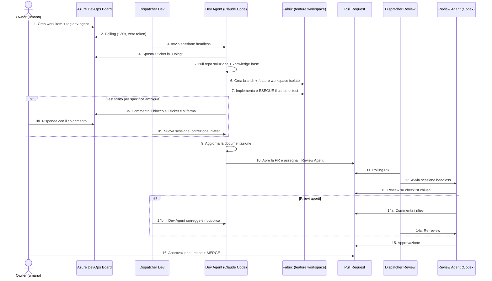
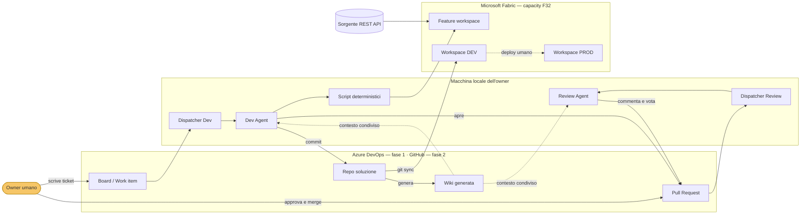

# PRD — Agentic CI/CD per Microsoft Fabric & Power BI

| Campo | Valore |
|---|---|
| Versione | 0.1 (Draft) |
| Data | 2026-08-20 |
| Autore | Karl (Business Analyst) su intervista con Alessio Andriulo |
| Stato | Draft — in attesa di approvazione funzionale |
| Fonti di discovery | Trascrizione + screenshot video *"AI Agents Now Do My Fabric Data Engineering"* (Aleksi Partanen, MVP Microsoft), interviste di discovery del 2026-08-20 |
| Documenti collegati | `CONTEXT.md` (glossario e convenzioni) · `docs/functional/` (ciclo di vita, runbook, checklist, escalation, onboarding cliente) · `docs/technical/` (agent anatomy) · `docs/backlog/` (work item per slice) · `docs/adr/` (decisioni architetturali) |

---

## 1. Executive summary

Costruiamo una **catena di CI/CD agentica** in cui due agenti AI, con identità applicative distinte e vendor distinti, eseguono in autonomia il ciclo di sviluppo su una piattaforma dati Microsoft Fabric + Power BI: prendono in carico un work item dal tracker, sviluppano in un workspace isolato, **eseguono e verificano davvero** il risultato sulla piattaforma, aggiornano la documentazione, aprono una pull request e la sottopongono a code review automatica di un secondo agente di vendor differente.

L'intervento umano si riduce a due momenti: **scrivere il ticket** e **premere merge**.

Il progetto è un **asset interno Agic riusabile** e allo stesso tempo una **demo commerciale**: entrambi gli usi impongono che la soluzione sia agnostica rispetto alla sorgente dati e al tracker, non un one-off cucito su un caso specifico.

---

## 2. Contesto e problema

### 2.1 Situazione attuale

Il lavoro di delivery su Fabric/Power BI è oggi interamente manuale e ripetitivo in larga parte del suo volume:

- l'onboarding di una nuova sorgente o tabella nel layer bronze è un'operazione **procedurale e quasi identica ogni volta** (clone della pipeline, nuovo file di configurazione, run di test, documentazione);
- le change request su misure DAX, colonne, semantic model e report seguono anch'esse pattern ricorrenti;
- il tempo dei senior viene consumato da attività a basso valore aggiunto, mentre le attività di verifica (test del carico, controllo chiavi primarie, aggiornamento documentazione) sono le prime a essere sacrificate sotto pressione;
- la documentazione tende a divergere dall'implementazione reale.

### 2.2 Problema da risolvere

> Il collo di bottiglia non è la difficoltà tecnica del singolo task, ma il **costo di coordinamento e di rigore** attorno a task ripetitivi: aprire branch, isolare l'ambiente, eseguire il test, aggiornare i documenti, far revisionare il codice.

### 2.3 Perché ora

- Fabric espone Git integration, REST API e `fab` CLI sufficienti a pilotare il control plane in modo programmatico.
- Gli agenti CLI headless (Claude Code, Codex) sono maturi per sessioni non interattive con permessi ristretti.
- Il pattern è già stato dimostrato pubblicamente end-to-end: non stiamo esplorando fattibilità, stiamo industrializzando e generalizzando.

### 2.4 Delta rispetto al pattern di riferimento

Non stiamo replicando il video. Tre scostamenti strutturali:

| # | Riferimento (video) | Nostro requisito | Impatto |
|---|---|---|---|
| D1 | Sorgente unica Azure SQL, copy activity SQL-only | **Multi-sorgente fin dall'MVP**: REST API e File, con il framework che deve adattarsi anche a DWH, CRM e altri Lakehouse | Alto — serve un contratto di connettore, non un clone di pipeline |
| D2 | Solo data engineering | Anche **Power BI**: semantic model (TMDL/PBIP, DAX) e report (PBIR) | Alto — serve una seconda "corsia" di validazione, non riusabile da quella dati |
| D3 | Solo Azure DevOps | Azure Boards per ticket + GitHub per codice, PR e GitHub Actions | Medio — il livello tracker e il repository restano disaccoppiati |

---

## 3. Obiettivi e KPI

### 3.1 Obiettivi di business

| ID | Obiettivo |
|---|---|
| OB-1 | Ridurre il tempo-uomo per i task ripetitivi di delivery Fabric/Power BI |
| OB-2 | Alzare il livello minimo di rigore: nessuna modifica arriva in `main` senza test eseguito, documentazione aggiornata e review indipendente |
| OB-3 | Mantenere la documentazione allineata all'implementazione per costruzione, non per disciplina |
| OB-4 | Disporre di un asset dimostrabile in prevendita, riusabile su clienti diversi |

### 3.2 KPI (baseline da rilevare durante lo Slice 0)

| ID | KPI | Definizione | Target MVP |
|---|---|---|---|
| KPI-1 | Autonomia | % di ticket portati da "To Do" a PR approvata senza intervento umano oltre il ticket iniziale e il merge | ≥ 60% |
| KPI-2 | Lead time | Tempo mediano da creazione ticket ad apertura PR | < 30 min per onboarding tabella bronze |
| KPI-3 | Cicli di review | Numero medio di iterazioni Review Agent ↔ Dev Agent prima dell'approvazione | ≤ 2 |
| KPI-4 | Copertura documentale | % di PR che includono aggiornamento della documentazione pertinente | 100% (bloccante) |
| KPI-5 | Costo | Costo token medio per ticket completato, per tipologia | Da rilevare, poi trend decrescente |
| KPI-6 | Difetti sfuggiti | Difetti rilevati dopo il merge su modifiche prodotte da agenti | 0 su `main` per lo scope MVP |
| KPI-7 | Costo a vuoto | Consumo token del sistema in idle | ≈ 0 (il polling non deve usare LLM) |

---

## 4. Non-obiettivi

Espliciti, per proteggere lo scope:

- **NO-1** — Non automatizziamo il merge su `main` né il deploy verso test/prod: restano umani per decisione esplicita.
- **NO-2** — Non costruiamo una UI o un portale. L'interfaccia utente è il tracker (board, ticket, PR).
- **NO-3** — Non sostituiamo l'architetto: le decisioni architetturali non ovvie restano umane e vengono tracciate come ADR.
- **NO-4** — Non ospitiamo gli agenti in cloud in fase 1: i dispatcher girano sulla macchina locale dell'owner.
- **NO-5** — Non gestiamo dati reali di clienti in fase 1: solo dati sintetici/demo in ambiente sandbox.
- **NO-6** — Non copriamo in fase 1 i workload Real-Time Intelligence (Eventstream/Eventhouse/Activator).
- **NO-7** — Non implementiamo un motore di orchestrazione multi-agente generico: due ruoli, ben definiti, e basta.

---

## 5. Attori e personas

| Attore | Tipo | Descrizione | Responsabilità |
|---|---|---|---|
| **Owner / Human in the loop** | Umano | Il data engineer o lead che possiede la piattaforma | Scrive il ticket, risponde ai blocchi, approva e merge, promuove verso test/prod |
| **Dev Agent** | Agente (Claude Code, SPN dedicato) | Esegue il ciclo di sviluppo end-to-end | Branch, feature workspace, implementazione, test reale, documentazione, apertura PR. **Non merge mai** |
| **Review Agent** | Agente (Codex/OpenAI, SPN dedicato) | Revisione indipendente | Verifica la PR contro una checklist chiusa, commenta, vota. **Non scrive codice di feature, non merge** |
| **Dispatcher** | Script deterministico (non LLM) | Un processo per agente, in polling sul tracker | Rileva i trigger e avvia una sessione fresca dell'agente. Zero token da fermo |
| **Stakeholder / Prevendita** | Umano | Fruitore della demo commerciale | Consuma il flusso come dimostrazione |

**Principio identitario**: nessun agente gira con l'identità di un utente umano. Ogni agente ha un proprio service principal Entra, con permessi propri, tracciabili nell'audit log.

---

## 6. Scope

### 6.1 In scope — Fase 1 (MVP)

**Workload**
- Fabric Data Engineering: data pipeline, notebook, Spark Job Definition, Dataflow Gen2, lakehouse/warehouse e mirroring quando il tipo sorgente è supportato da Fabric
- Power BI: semantic model (TMDL/PBIP, misure DAX)
- Power BI: report (PBIR — pagine, visual, tema)

**Tipologie di ticket gestite**
- Nuova feature / onboarding di una nuova sorgente o tabella
- Creazione o modifica di data pipeline, notebook, Spark Job Definition, Dataflow Gen2, lakehouse/warehouse o Mirroring
- Analisi di anomalie dati, riconciliazioni, schema drift, carichi fermi e sorgenti
- Change request su artefatti esistenti
- Bug fix, con riproduzione e regression test
- Refactoring / debito tecnico

**Piattaforma**
- Tenant: **AGIC** (il tenant del cliente non dispone di Azure DevOps)
- Tracker: Azure DevOps Boards
- Repository, pull request e CI/CD: GitHub (`alessioandriuloagic/fabric-agentic`) e GitHub Actions
- Capacity Fabric: **F32**
- Nome progetto per il naming: **`agentic`** → `ws_agentic_dev`, `ws_agentic_prod`, `ws_agentic_feature_wi<id>`
- Service principal: **già disponibili** (uno per agente)
- Workspace: **creati da zero dal sistema stesso**, come primo caso d'uso reale
- Git integration Fabric ↔ GitHub: da configurare da zero
- Pubblicazione DEV: automatica via pipeline CI/CD dopo merge umano su `main`; test e produzione restano protetti da pipeline umane

**Sorgenti dati (multi-sorgente fin dall'MVP)**

| # | Tipologia | Sorgente concreta | Ruolo |
|---|---|---|---|
| 1 | **REST API** | **Open-Meteo** — archivio storico meteo: nessuna autenticazione, watermark naturale su data, volume e profondità storica adeguati | Primo connettore, tracer bullet |
| 2 | **File** | **Anagrafica città sintetica** (~1.000 righe, CSV/Parquet su OneLake Files) con coordinate geografiche | Secondo connettore, **prova dell'astrazione** |

I due dataset sono **correlati**: le coordinate dell'anagrafica città si agganciano alle
rilevazioni meteo, abilitando una join nel layer silver e quindi un semantic model e un report
sensati per la demo commerciale.

> **Decisione di design**: l'anagrafica città è la **dimensione** della join, non il driver
> delle chiamate REST. L'estrazione parametrizzata sulla tabella città (*parameter-driven
> extraction*) è un'evoluzione possibile, ma introduce dipendenza tra connettori e centinaia di
> chiamate per esecuzione: va decisa con ADR, non subita come effetto collaterale.

- Framework di ingestion: **metadata-driven già esistente, riusato** — un file JSON di configurazione per source system
- Naming convention, struttura a cartelle del workspace e task flow: definiti in `CONTEXT.md`

### 6.2 In scope — Fase 2

- Dispatcher e flusso equivalenti su **GitHub** (Issues + Pull Request)
- Ulteriori tipologie di connettore: altro Lakehouse Fabric (shortcut), Database/DWH, CRM (Dataverse), SharePoint/Excel
- Hosting dei dispatcher fuori dalla macchina locale
- Estensione ad altri workload Fabric

### 6.3 Fuori scope

Vedi sezione 4 (Non-obiettivi).

---

## 7. User journey end-to-end

Journey di riferimento: **onboarding di una nuova tabella sorgente nel layer bronze** (tracer bullet dell'MVP).

**Regola di comunicazione**: gli agenti **non comunicano mai direttamente tra loro**. Ogni scambio passa da un artefatto tracciabile — commento su ticket, commento su PR, voto. Questo garantisce che l'intero ragionamento sia auditabile a posteriori da un umano.

---

## 8. Requisiti funzionali

### 8.1 Trigger e dispatch

| ID | Requisito | Priorità |
|---|---|---|
| RF-01 | Il sistema rileva un work item pronto per l'agente tramite un marcatore esplicito (tag dedicato) e uno stato definito | Must |
| RF-02 | Il polling avviene tramite script deterministico, **senza consumare token LLM** in assenza di lavoro | Must |
| RF-03 | Il Dev Agent viene attivato da: (a) nuovo work item taggato, (b) risposta umana su un ticket in attesa di input, (c) thread attivi sulla propria PR | Must |
| RF-04 | Il Review Agent viene attivato da un'unica condizione: PR attiva in cui il suo voto non è "approvato" — copre sia la prima review sia le re-review dopo push | Must |
| RF-05 | Ogni attivazione avvia una **sessione nuova e senza stato**: lo stato persiste solo su tracker e Git | Must |
| RF-06 | Il livello di integrazione con il tracker è isolato dietro un'astrazione, per consentire l'aggiunta di GitHub in fase 2 senza riscrivere la logica degli agenti | Must |

### 8.2 Ciclo di sviluppo del Dev Agent

| ID | Requisito | Priorità |
|---|---|---|
| RF-10 | All'avvio, l'agente aggiorna la propria copia locale del repo soluzione **e** della knowledge base | Must |
| RF-11 | L'agente legge la knowledge base come contesto vincolante prima di qualsiasi modifica (convenzioni di naming, pattern architetturali, runbook) | Must |
| RF-12 | L'agente aggiorna lo stato del work item durante il ciclo (in lavorazione, bloccato, in review) | Must |
| RF-13 | L'agente crea un branch feature e un **feature workspace Fabric isolato**, con naming convention deterministica legata all'ID del work item | Must |
| RF-14 | L'owner umano viene automaticamente aggiunto come amministratore di ogni feature workspace creato | Must |
| RF-15 | L'agente implementa la modifica in Git e la materializza nel feature workspace tramite sync | Must |
| RF-16 | Le operazioni ripetitive di piattaforma (branch out, esecuzione carico, sync workspace) sono eseguite tramite **script deterministici pre-esistenti**, non reinventate dall'LLM a ogni sessione | Must |
| RF-17 | Al termine, l'agente apre una PR e vi assegna il Review Agent come revisore | Must |
| RF-18 | Dopo il merge umano, una pipeline CI/CD ancorata a `main` pubblica automaticamente il commit su DEV; il feature workspace resta soggetto allo Sweep schedulato con TTL | Must |
| RF-19 | Ogni item creato dall'agente rispetta le convenzioni di naming di `CONTEXT.md` (prefisso per tipo) ed è collocato nella **cartella del proprio layer**: nessun item alla radice del workspace | Must |
| RF-20 | Il workspace espone un **task flow** che rappresenta il flusso end-to-end (Get data → Bronze → Full & Incremental Load → Silver → Semantic → Report) | Should |

### 8.3 Verifica e test (data lane)

| ID | Requisito | Priorità |
|---|---|---|
| RF-21 | La modifica deve essere **eseguita realmente** nel feature workspace prima dell'apertura della PR: nessuna PR su codice non eseguito | Must |
| RF-22 | Il carico di test verifica almeno: unicità delle chiavi primarie dichiarate, conteggi di audit sorgente vs destinazione, esito dello scrittura | Must |
| RF-23 | Le regole di qualità dato vivono nel **framework**, non nelle istruzioni dell'agente: l'agente ne cita l'esito, non le implementa ad hoc | Must |
| RF-24 | In caso di fallimento riconducibile a una specifica ambigua o errata, l'agente **si ferma, documenta il blocco sul ticket e attende input umano** — non tira a indovinare | Must |
| RF-25 | L'evidenza dell'esecuzione (esito, conteggi, run id) è allegata alla PR come prova verificabile dal Review Agent | Must |
| RF-26 | Ticket di anomalia dati, riconciliazione, schema drift, carico fermo e analisi sorgente invocano un rail diagnostico che restituisce evidenze aggregate o mascherate | Must |
| RF-27 | Il modello non riceve righe grezze, PII o segreti dalle analisi diagnostiche, salvo canale esplicitamente approvato dal cliente e fuori dal flusso autonomo | Must |

### 8.4 Sorgenti dati agnostiche

| ID | Requisito | Priorità |
|---|---|---|
| RF-30 | Il framework metadata-driven **esistente viene riusato**: la configurazione JSON per source system è il formato di riferimento, non se ne introduce uno nuovo | Must |
| RF-31 | Il framework espone un **contratto di connettore** che disaccoppia la logica di orchestrazione dalla tipologia di sorgente | Must |
| RF-32 | In fase 1 sono implementati **due connettori di tipologia diversa**: REST API e File. Il secondo è la verifica che l'astrazione regga | Must |
| RF-33 | L'onboarding di una nuova sorgente o di un nuovo dataset avviene per **configurazione dichiarativa**, non per scrittura di codice ad hoc | Must |
| RF-34 | L'aggiunta di una nuova tipologia di sorgente (DWH, CRM, altro Lakehouse) non richiede modifiche alla logica degli agenti | Must |
| RF-35 | Se un onboarding richiede codice nuovo, l'agente lo segnala come **rilievo architetturale sul ticket** anziché aggirare l'astrazione mancante | Should |
| RF-36 | La configurazione dichiara esplicitamente la modalità di carico (full / incremental) e, se incrementale, la watermark column | Must |
| RF-37 | Ogni cliente configura una `ExecutionCredential` usata solo dalle pipeline: SP OIDC, SP con secret o utenza di servizio custodita nel secret store | Must |
| RF-38 | L'agente non legge, esporta o impersona la `ExecutionCredential`; il tipo di credenziale non modifica il contratto di connettore o dei rail | Must |

### 8.5 Power BI lane

| ID | Requisito | Priorità |
|---|---|---|
| RF-40 | L'agente opera su semantic model e report in formato testuale versionabile (TMDL/PBIP, PBIR), non su file binari | Must |
| RF-41 | Esiste una validazione automatica per le modifiche al semantic model: sintassi, integrità del modello, esecuzione delle misure impattate | Must |
| RF-42 | Esiste una regression suite per le misure DAX critiche, eseguita prima dell'apertura della PR | Must |
| RF-43 | Le modifiche ai report sono validate strutturalmente (PBIR valido, riferimenti a campi esistenti nel modello) | Must |
| RF-44 | Le convenzioni di naming di tabelle, colonne e misure sono definite nel glossario di dominio e verificate in review | Must |

### 8.6 Documentazione

| ID | Requisito | Priorità |
|---|---|---|
| RF-50 | La knowledge base condivisa dagli agenti è **strutturata e versionata**: `/docs` e `CONTEXT.md` nel repo sono la fonte di verità, la wiki del tracker è generata da essi | Must |
| RF-52 | Ogni PR che modifica il comportamento include l'aggiornamento della documentazione pertinente: **è un criterio bloccante in review** | Must |
| RF-53 | La knowledge base include almeno: architettura della piattaforma, convenzioni di naming, schema dei metadati, runbook di onboarding, inventario delle sorgenti e delle tabelle | Must |
| RF-54 | Ogni PR aggiunge la propria voce al `CHANGELOG.md` sotto `[Unreleased]` | Must |
| RF-55 | Le decisioni architetturali non reversibili sono registrate come ADR | Should |

### 8.7 Code review agentica

| ID | Requisito | Priorità |
|---|---|---|
| RF-60 | Il Review Agent gira su **vendor e modello diversi** dal Dev Agent: nessun agente corregge i propri compiti | Must |
| RF-61 | La review è condotta contro una **checklist chiusa e versionata**, non a discrezione del modello | Must |
| RF-62 | Il Review Agent verifica il diff sulla propria copia del repo: **non si fida della descrizione della PR** | Must |
| RF-63 | Il Review Agent produce un esito strutturato per ogni voce di checklist (passato / rilievo / corretto) | Must |
| RF-64 | Il Review Agent **non ha alcun accesso a Fabric**: giudica la verità di Git e le evidenze allegate | Must |
| RF-65 | Ogni affermazione su capacità o comportamenti della piattaforma Fabric deve essere verificata sulla documentazione ufficiale prima di essere dichiarata, da entrambi gli agenti | Must |
| RF-66 | Un disaccordo tra Dev Agent e Review Agent che non si risolve in due iterazioni **escala all'umano**, non entra in loop | Must |

### 8.8 Governance e human-in-the-loop

| ID | Requisito | Priorità |
|---|---|---|
| RF-70 | Il merge su `main` è **sempre e solo umano**, senza eccezioni per tipologia di modifica | Must |
| RF-71 | L'approvazione umana è obbligatoria **in aggiunta** a quella del Review Agent | Must |
| RF-72 | Il deploy verso test e produzione è **solo umano** | Must |
| RF-73 | Il divieto di push e merge su `main` per gli agenti è imposto da **branch policy e permessi di piattaforma**, non solo da istruzioni testuali | Must |
| RF-74 | Ogni azione degli agenti è tracciabile alla rispettiva identità applicativa nell'audit log | Must |
| RF-75 | Il Dev Agent può accodare solo pipeline CI/CD agentiche dedicate a feature e dev; le pipeline test/prod sono riservate agli umani | Must |
| RF-76 | La definizione di ogni pipeline privilegiata è ancorata a `main`; il branch di feature è un parametro, mai la fonte della definizione | Must |
| RF-77 | L'ambiente di destinazione non è un parametro delle pipeline agentiche | Must |
| RF-78 | Ogni pipeline agentica restituisce un artefatto `rail-result.json` versionato, con esito tecnico o di qualità esplicito | Must |
| RF-79 | Le modifiche Power BI sono promosse tramite pipeline CI/CD e `fabric-cicd`, non con Fabric Deployment Pipelines | Must |

### 8.9 Istanziazione su un nuovo progetto o cliente

| ID | Requisito | Priorità |
|---|---|---|
| RF-80 | La soluzione è istanziabile su un nuovo progetto o cliente senza modifiche al codice: le parti specifiche dell'istanza vivono in **un unico punto parametrico** | Must |
| RF-81 | La creazione delle identità applicative e l'assegnazione dei permessi sono **fuori dal perimetro degli agenti**, in modo permanente: nessun agente può creare o modificare la propria identità o i propri permessi | Must |
| RF-82 | Il bootstrap di un nuovo progetto (identità, repo, board, branch policy, knowledge base, dispatcher) è guidato da una **checklist verificabile**, con supporto di script deterministici | Must |
| RF-83 | La branch policy che nega agli agenti il push e il merge su `main` è **verificata praticamente** al bootstrap, non solo configurata | Must |
| RF-84 | Il bootstrap della piattaforma dati (workspace, cartelle, task flow, Git integration) avviene tramite un **ticket agentico**, non manualmente | Must |
| RF-85 | La documentazione funzionale e la checklist di review sono parte dell'asset riusabile e vengono portate nel nuovo progetto al bootstrap | Must |

---

## 9. Requisiti non funzionali

| ID | Categoria | Requisito |
|---|---|---|
| RNF-01 | Sicurezza | Ogni agente gira sotto un proprio service principal, con il minimo privilegio necessario. Il perimetro è definito dai permessi, non dalle istruzioni: *ciò che l'agente può tecnicamente fare, prima o poi lo farà* |
| RNF-02 | Sicurezza | Accesso negato in modo esplicito a variabili d'ambiente, token cache e dump di credenziali, anche in modalità permissiva |
| RNF-03 | Sicurezza | Nessun segreto in chiaro nel repo, nei notebook, nelle definizioni di pipeline o nella configurazione degli agenti |
| RNF-04 | Privacy | In fase 1 gli agenti operano esclusivamente su dati sintetici in ambiente sandbox dedicato |
| RNF-05 | Costo | Il sistema non consuma token in assenza di lavoro; le operazioni deterministiche non passano dall'LLM |
| RNF-06 | Costo | Il consumo di capacity generato dai feature workspace è monitorato e i workspace orfani vengono rimossi |
| RNF-07 | Affidabilità | Le sessioni sono senza stato e idempotenti: una sessione interrotta può essere rilanciata senza effetti collaterali |
| RNF-08 | Osservabilità | Ogni sessione produce un log persistente correlabile al work item e alla PR |
| RNF-09 | Portabilità | La logica degli agenti è indipendente dal tracker specifico (requisito abilitante per GitHub in fase 2) |
| RNF-10 | Manutenibilità | Le istruzioni degli agenti sono versionate nel repo e soggette a review come il codice |
| RNF-11 | Riusabilità | Nessun riferimento hard-coded a un cliente, un tenant o una sorgente specifica nella parte riusabile dell'asset |

---

## 10. Architettura logica

### 10.1 Principio dei "rail"

Gli agenti **orchestrano**, gli script **eseguono**. Tutto ciò che è procedurale e identico a ogni giro (creazione branch e workspace, esecuzione del carico, sync da Git) vive in script deterministici versionati nel repo. Tre benefici, tutti misurabili:

1. **Costo** — l'LLM non riscopre l'API plumbing a ogni sessione;
2. **Prevedibilità** — l'operazione ripetitiva ha sempre lo stesso esito;
3. **Focalizzazione** — la capacità di giudizio del modello viene spesa dove serve davvero: interpretare il ticket, leggere i dati, valutare la review.

### 10.2 Asimmetria delle capacità

Il Dev Agent ha una cassetta degli attrezzi ampia (Git, script, CLI Fabric, tracker, documentazione ufficiale). Il Review Agent ha una cassetta **deliberatamente vuota**: nessun accesso a Fabric, nessuno script di build. Non può produrre l'evidenza che deve giudicare — e questo è esattamente il punto.

---

## 11. Modello di permessi

| Ambito | Dev Agent | Review Agent |
|---|---|---|
| Repo soluzione | Contribuisci, crea branch, contribuisci alle PR | **Sola lettura** + commento e voto |
| Knowledge base | Contribuisci | Sola lettura |
| Work item | Lettura e scrittura | Sola lettura + commento |
| Push su `main` | **NEGATO** — deny esplicito + branch policy | **NEGATO** |
| Merge | **NEGATO** — revisore umano obbligatorio | **NEGATO** |
| Creazione workspace Fabric | **Negata**: avviene tramite identità di deploy della pipeline | **Nessun accesso a Fabric** |
| Capacity F32 | Contributor | Nessun accesso |
| Connessione alla sorgente dati | Utente | Nessun accesso |
| Variabili d'ambiente / token cache | **NEGATO** | **NEGATO** |
| Deploy verso test/prod | **NEGATO** | **NEGATO** |

---

## 12. Vincoli e assunzioni

### 12.1 Vincoli

| ID | Vincolo |
|---|---|
| V-1 | Capacity Fabric F32 già disponibile sul tenant AGIC |
| V-2 | I dispatcher girano sulla macchina locale dell'owner in fase 1; i due agenti sono isolati tra loro a livello di ambiente di esecuzione |
| V-3 | Service principal già disponibili; il tracker non consente l'assegnazione diretta di work item a un service principal — serve un marcatore alternativo (tag) |
| V-4 | Gli agenti girano in sessione non interattiva: non possono chiedere conferme a runtime, quindi il perimetro deve essere garantito dai permessi |
| V-5 | La sessione di un service principal sul control plane Fabric ha durata limitata e va rinnovata a ogni avvio |
| V-6 | Sorgenti dati eterogenee: REST API (Open-Meteo) e File (dataset sintetico). La soluzione non deve assumere alcuna tipologia di sorgente specifica |
| V-7 | Workflow Git: GitHub Flow, branch feature a vita breve, `main` sempre rilasciabile |
| V-8 | Naming convention, struttura a cartelle del workspace e task flow sono definiti in `CONTEXT.md` e sono vincolanti per gli agenti |
| V-9 | Tutto vive sul **tenant AGIC**: il tenant del cliente non dispone di Azure DevOps. Nessun dato di cliente entra nel perimetro |

### 12.2 Assunzioni da validare

| ID | Assunzione | Come validarla |
|---|---|---|
| A-1 | Il framework metadata-driven esistente accoglie un secondo connettore senza modifiche strutturali all'orchestrazione | Slice 4 — è il test dell'astrazione |
| A-2 | Il volume dei feature workspace è sostenibile sulla F32 senza impatto sui carichi esistenti | Monitoraggio consumo in Slice 0-1 |
| A-3 | Open-Meteo espone volume, paginazione e granularità temporale sufficienti a esercitare full e incremental load | Discovery tecnica in Slice 2 |
| A-4 | La validazione automatica di TMDL/PBIR è realizzabile con il tooling disponibile senza Power BI Desktop interattivo | Spike dedicato prima dello Slice 6 |
| A-5 | Le cartelle sono creabili via API; il task flow è un passo manuale documentato e non blocca la review | Deciso in ADR-0003 |

---

## 13. Rischi

| ID | Rischio | Impatto | Prob. | Mitigazione |
|---|---|---|---|---|
| R-1 | L'agente prende iniziative non richieste ("creatività" fuori perimetro) | Alto | Alta | Rail deterministici, checklist chiusa, permessi restrittivi, knowledge base come vincolo esplicito |
| R-2 | Documentazione di partenza incompleta → gli agenti improvvisano | Alto | Alta | La knowledge base è **prerequisito bloccante** dello Slice 0, non un deliverable finale |
| R-3 | Disaccordo persistente tra i due agenti → loop e consumo token | Medio | Media | Escalation obbligatoria all'umano dopo due iterazioni (RF-66) |
| R-4 | Consumo capacity non controllato dai feature workspace | Medio | Media | Naming deterministico, cleanup post-merge, monitoraggio (@mike) |
| R-5 | Esposizione di dati verso vendor LLM | Alto | Bassa in fase 1 | Solo dati sintetici in sandbox; valutazione di hosting alternativo prima di qualsiasi uso su dati di cliente |
| R-6 | La lane Power BI risulta più complessa del previsto e blocca l'MVP | Medio | Media | Slice separato e posteriore al tracer bullet dati; spike A-4 preventivo |
| R-7 | Escalation di privilegi involontaria del service principal | Alto | Bassa | Principio del minimo privilegio, deny espliciti, revisione periodica dei permessi |
| R-8 | Dipendenza da un singolo vendor LLM (cambio di pricing o policy) | Medio | Media | L'astrazione del runtime agente è già implicita nell'uso di due vendor diversi |

---

## 14. Roadmap a slice

Ogni slice è verticale e produce valore osservabile: non "prima tutta l'infrastruttura, poi gli agenti".

| Slice | Titolo | Obiettivo osservabile |
|---|---|---|
| **S0** | Fondamenta e knowledge base | Repo, struttura `/docs`, `CONTEXT.md`, documentazione funzionale, service principal configurati, branch policy che nega il push su `main` agli agenti **e verificata praticamente**. **Baseline KPI rilevata** |
| **S1** | Primo ticket agentico: creazione workspace | Un work item "crea workspace DEV e PROD" viene preso in carico dal Dev Agent, che crea i workspace con **naming, cartelle e task flow** da `CONTEXT.md`, configura la Git integration e apre la PR. *È il primo caso d'uso reale scelto dall'owner* |
| **S2** | Tracer bullet dati — connettore REST | Ticket "onboarda un dataset da Open-Meteo nel bronze": nuova voce nel JSON di configurazione, carico eseguito, controlli PK e audit verdi, documentazione aggiornata, PR aperta |
| **S3** | Review agentica | Il Review Agent revisiona la PR dello Slice 2 contro checklist chiusa, solleva almeno un rilievo, il Dev Agent corregge, il Review Agent approva |
| **S4** | Secondo connettore — File | Ticket "onboarda l'anagrafica città da file CSV/Parquet": **il vero test dell'astrazione**. Se richiede modifiche all'orchestrazione, il contratto di connettore va rivisto prima di procedere |
| **S5** | Gestione dell'ambiguità | Ticket con specifica volutamente errata: l'agente rileva il problema, si ferma, commenta, riceve il chiarimento umano e corregge |
| **S6** | Power BI lane | Ticket di change request su misura DAX in un semantic model, con regression test eseguito prima della PR |
| **S7** | Bug fix e refactoring | Estensione delle tipologie di ticket coperte, con riproduzione e regression test |
| **S8** | Doppio tracker | Replica del flusso su GitHub (Issues + PR), riusando l'astrazione tracker |

---

## 15. Criteri di accettazione dell'MVP

L'MVP è accettato quando, **senza alcun intervento tecnico dell'owner oltre alla scrittura del ticket e al merge**:

1. Un work item taggato per l'agente viene preso in carico entro un ciclo di polling;
2. Viene creato un branch feature e un feature workspace isolato, con l'owner amministratore;
3. La modifica viene implementata secondo le convenzioni della knowledge base;
4. Il carico viene **eseguito realmente** e i controlli di qualità dato risultano verdi, con evidenza allegata;
5. La documentazione pertinente e il `CHANGELOG.md` risultano aggiornati nella stessa PR;
6. Il Review Agent, di vendor diverso, produce un esito strutturato su checklist chiusa;
7. Almeno un ciclo di correzione agent↔agent avviene senza intervento umano;
8. Nessuna delle azioni sopra è tecnicamente in grado di raggiungere `main` senza approvazione umana;
9. Il sistema in idle consuma zero token LLM.

---

## 16. Domande aperte

| ID | Domanda | Owner | Stato |
|---|---|---|---|
| ~~Q-1~~ | ~~Il framework metadata-driven esistente va riusato, adattato o riscritto?~~ | — | **Chiusa 2026-08-20**: riusato as-is, la configurazione JSON per source system è il formato di riferimento |
| ~~Q-2~~ | ~~Quale sorgente REST usiamo per i test?~~ | — | **Chiusa 2026-08-20**: Open-Meteo, REST API pubblica senza autenticazione; Business Central non è disponibile nello scope MVP |
| ~~Q-8~~ | ~~Quali convenzioni di naming adottiamo?~~ | — | **Chiusa 2026-08-20**: formalizzate in `CONTEXT.md`, progetto `agentic` |
| ~~Q-10~~ | ~~Quale ambiente Business Central e quale autenticazione?~~ | — | **Chiusa 2026-08-20**: BC non disponibile, si usa Open-Meteo (nessuna autenticazione) + file sintetici |
| ~~Q-11~~ | ~~Quale dominio e quale volume per il dataset sintetico?~~ | — | **Chiusa 2026-08-20**: anagrafica città con coordinate, ~1.000 righe, correlata a Open-Meteo |
| ~~Q-3~~ | ~~Con quale tooling validiamo TMDL/PBIR in modo non interattivo?~~ | — | **Chiusa 2026-08-20**: `fabric-cicd==1.3.0` supporta `SemanticModel` TMDL e `Report` PBIR; S1-01 valida binding e deploy reale |
| Q-4 | Qual è la definizione operativa di "regression suite DAX" e quali misure sono critiche? | @marco / @kent | Aperta — blocca S6 |
| ~~Q-5~~ | ~~Quale strategia di cleanup dei feature workspace e quale soglia F32?~~ | — | **Chiusa 2026-08-20**: Sweep pipeline schedulata (ADR-0004), capacity monitorata per F32 |
| Q-6 | La checklist di review va versionata nel repo soluzione o nella knowledge base? | @joseph | Aperta — blocca S3 |
| ~~Q-7~~ | ~~Quale opzione di hosting degli agenti prima dell'uso su dati cliente?~~ | — | **Chiusa 2026-08-20**: Viewer solo per dati sintetici/open data; con dati cliente Viewer revocato e diagnostica via artefatto (ADR-0008) |
| ~~Q-9~~ | ~~Cartelle del workspace e task flow sono creabili via API/CLI?~~ | — | **Chiusa 2026-08-20**: cartelle via API; task flow rimane un passo manuale (ADR-0003) |
| Q-12 | Con quale strumento generiamo l'anagrafica città sintetica, e come la versioniamo? | @reza | Aperta — blocca S4 |

---

## 17. Glossario

I termini di dominio, le convenzioni di naming e i principi non negoziabili sono mantenuti in
`CONTEXT.md` alla radice del repo, che è il *shared context* letto dagli agenti a ogni sessione.
Termini chiave introdotti da questo PRD:

| Termine | Definizione |
|---|---|
| **Dev Agent** | Agente AI che esegue il ciclo di sviluppo end-to-end su un work item. Non merge mai |
| **Review Agent** | Agente AI, di vendor diverso, che revisiona la PR contro una checklist chiusa. Non scrive codice di feature |
| **Dispatcher** | Script deterministico in polling sul tracker che avvia una sessione fresca dell'agente. Non usa LLM |
| **Rail (script deterministico)** | Script versionato che esegue un'operazione procedurale ripetitiva al posto dell'LLM |
| **Feature workspace** | Workspace Fabric isolato e temporaneo, creato per un singolo work item |
| **Knowledge base / shared context** | Documentazione strutturata che entrambi gli agenti leggono a ogni sessione come vincolo |
| **Checklist chiusa** | Elenco versionato e finito di criteri di review: il Review Agent non ne aggiunge di propri |
| **Tracer bullet** | Slice verticale sottile che attraversa l'intera catena end-to-end per validarla |
| **Contratto di connettore** | Interfaccia che disaccoppia l'orchestrazione dell'ingestion dalla tipologia di sorgente |
| **Connettore** | Implementazione del contratto per una specifica tipologia di sorgente (REST, File, DWH, CRM…) |

---

## 18. Prossimi passi

1. **Revisione e approvazione funzionale di questo PRD** da parte dell'owner
2. Risoluzione delle domande Q-9 e Q-12 — handoff a @reza
3. Decomposizione in work item sul tracker, slice per slice
4. Avvio dello Slice 0

