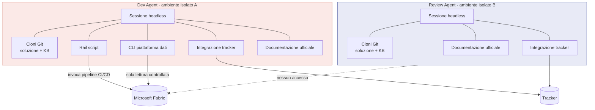

# 01 — Architettura degli agenti

> Anatomia dei due agenti: cosa hanno in mano, cosa non hanno, e perché.

---

## 1. Il principio di asimmetria

I due agenti **non sono due istanze della stessa cosa con permessi diversi**. Sono progettati
come opposti complementari:

| | Dev Agent | Review Agent |
|---|---|---|
| Vendor / modello | Vendor A | **Vendor B — diverso, obbligatorio** |
| Ambiente di esecuzione | Isolato | Isolato, separato dal primo |
| Toolbox | Ampia | **Deliberatamente minima** |
| Accesso a Fabric | Solo lettura/diagnosi controllata; la scrittura passa da pipeline CI/CD | **Nessuno** |
| Produce artefatti | Sì | No |
| Produce evidenze | Sì | **No — può solo leggerle** |

### Perché vendor diversi

Due istanze dello stesso modello condividono gli stessi punti ciechi. Il revisore non vedrebbe
proprio ciò che lo sviluppatore non ha visto, e la review diventerebbe una conferma
sistematica anziché un controllo.

### Perché il revisore non ha strumenti

Il Review Agent deve giudicare le evidenze prodotte dal Dev Agent. Se potesse produrle da sé,
davanti a un'evidenza mancante la genererebbe — e il vincolo "nessuna PR su codice non eseguito"
diventerebbe inapplicabile. **L'impotenza del revisore è una funzionalità, non una limitazione.**

---

## 2. Dev Agent

### 2.1 Identità e collocazione

| Aspetto | Valore |
|---|---|
| Identità | Service principal dedicato (client credentials, nessun account utente) |
| Ambiente | Macchina locale dell'owner, ambiente di esecuzione isolato |
| Modalità | Sessione headless, non interattiva |
| Stato | **Nessuno**: ogni sessione parte pulita |

### 2.2 Toolbox

| Strumento | A cosa serve | Perché è lì |
|---|---|---|
| **Due cloni Git** — soluzione + knowledge base | Il prodotto del lavoro e il contesto | Lo stato vive in Git e nel tracker, non nella memoria del modello. Ogni sessione inizia con un aggiornamento di entrambi |
| **Rail script** | Operazioni procedurali ripetitive | L'LLM non deve riscoprire l'API plumbing a ogni giro: costa token ed è imprevedibile |
| **CLI della piattaforma dati** | Diagnostica control plane Fabric | Interrogazioni consentite. La creazione o modifica di item passa dalle pipeline CI/CD, mai dalla sessione dell'agente |
| **Integrazione tipata con il tracker** | Work item, PR, commenti | Strumenti tipati anziché chiamate REST scritte a mano: meno superficie d'errore |
| **Accesso alla documentazione ufficiale** | Verifica delle affermazioni di piattaforma | Regola dura: nessuna affermazione su Fabric senza verifica. Molto più economico di una ricerca web generica |

### 2.3 Cosa NON ha

- Permesso di push o merge su `main` — negato da policy, non da istruzione
- Accesso alle variabili d'ambiente e alla cache dei token
- Capacità di modificare permessi, policy o identità
- Accesso a dati di cliente

### 2.4 Modalità di esecuzione

L'agente gira in modalità non interattiva: **non può chiedere conferme a runtime**. Ne discende
un vincolo di progettazione preciso:

> Poiché non può chiedere il permesso, il perimetro deve essere garantito **prima**, dai permessi
> della piattaforma. Le istruzioni testuali sono un'indicazione di comportamento, non un controllo
> di sicurezza.

Corollario: le regole di deny (variabili d'ambiente, token) devono restare attive anche in
modalità non interattiva, e vanno verificate praticamente al bootstrap.

---

## 3. Review Agent

### 3.1 Identità e collocazione

| Aspetto | Valore |
|---|---|
| Identità | Service principal dedicato, **distinto** da quello del Dev Agent |
| Ambiente | Ambiente di esecuzione separato da quello del Dev Agent |
| Modalità | Sessione headless, non interattiva |
| Stato | Nessuno |

### 3.2 Toolbox

| Strumento | Note |
|---|---|
| **Due cloni Git** — soluzione + knowledge base | Verifica il diff sulle **proprie** copie: non si fida della descrizione della PR |
| **Integrazione tipata con il tracker** | Commenti, thread, voti sulla PR |
| **Accesso alla documentazione ufficiale** | Una contraddizione tra i documenti modificati e la documentazione ufficiale è un rilievo (checklist E4) |

### 3.3 Cosa NON ha — ed è intenzionale

| Assente | Conseguenza voluta |
|---|---|
| Rail script | Non può costruire né eseguire nulla |
| CLI della piattaforma dati | Giudica la verità di Git, non lo stato del workspace |
| Qualsiasi accesso a Fabric | Un'evidenza mancante resta mancante: non può procurarsela |
| Permessi di scrittura sul repo | Può commentare e votare, non modificare |

---

## 4. Perché due cloni Git e non uno

Il repo della **soluzione** e quello della **knowledge base** sono separati per una ragione
funzionale, non organizzativa:

| Repo | Regime di modifica |
|---|---|
| Soluzione | Protetto: ogni modifica passa da PR e approvazione umana |
| Knowledge base | La documentazione atterra direttamente, senza gate di merge |

La documentazione deve poter essere aggiornata dall'agente **nella stessa sessione** in cui
implementa, altrimenti "documentazione aggiornata nella stessa PR" diventa impraticabile.

> **Nota di coerenza**: `/docs` nel repo soluzione resta la **fonte di verità**; la knowledge
> base consultabile dal tracker è **generata** da essa. Il meccanismo di generazione è un punto
> di attenzione: se diverge, gli agenti leggono un contesto obsoleto.
> **DA VERIFICARE** — modalità di generazione e sincronizzazione (collegato a Q-6).

---

## 5. Il principio dei rail

> **Gli agenti orchestrano, gli script eseguono.**

| Tipo di attività | Chi la svolge |
|---|---|
| Interpretare il ticket | Agente |
| Interpretare evidenze aggregate/mascherate e valutare gli esiti | Agente |
| Rispondere a un rilievo di review | Agente |
| Creare branch e workspace | **Script** |
| Sviluppare pipeline, notebook, Dataflow, SJD, Lakehouse/Warehouse, Mirroring o item Power BI in Git | **Agente** |
| Materializzare e validare gli item nel feature workspace | **Pipeline CI/CD** |
| Pubblicare su `dev` dopo merge umano | **Pipeline CI/CD** ancorata a `main` |
| Eseguire un carico e attenderne l'esito | **Script** |
| Sincronizzare il workspace da Git | **Script** |

Tre benefici misurabili:

1. **Costo** — l'operazione procedurale non passa dal modello
2. **Prevedibilità** — stesso input, stesso esito, sempre
3. **Focalizzazione** — la capacità di giudizio si spende dove serve

> Regola pratica: se un'operazione è identica a ogni giro, **non deve essere ragionata**.
> Ogni volta che l'agente "capisce come fare" qualcosa che aveva già fatto la sessione
> precedente, stai pagando due volte per lo stesso risultato — e con esito non garantito.

---

## 6. Diagramma di insieme

