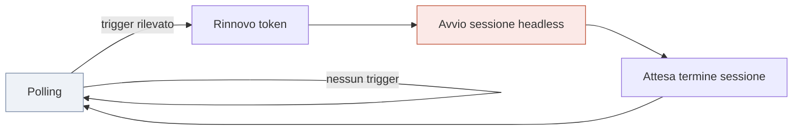

# 02 — Dispatcher

> Il componente che decide **quando** un agente deve svegliarsi. È volutamente il pezzo più
> stupido dell'intero sistema.

---

## 1. Il principio

> **Il modello non fa polling. Il polling lo fa uno script.**

Il dispatcher è un processo deterministico, senza LLM, che interroga periodicamente il tracker e
avvia una sessione **solo quando c'è effettivamente qualcosa da fare**.

Il risultato della sessione viene verificato: un exit code non riuscito produce un errore esplicito
(`Dev Agent session failed`) dopo la persistenza del dispatch. Il ciclo non viene quindi registrato
come completato con successo e lo stato conserva l'ID già assegnato per evitare duplicazioni.

Per GitHub il handoff include il body dell'issue. Gli allegati destinati all'automazione sono
versionati in `attachments/<issue-number>/` e vengono letti direttamente dalla clone isolata;
non si dipende dal download degli URL `user-attachments`, che non ha un endpoint GitHub App
documentato. Ogni file è limitato a 10 MiB; token e contenuti non entrano nei log.

Conseguenza diretta: a sistema fermo il costo è **zero**. Se il polling fosse affidato al modello,
pagheresti token per scoprire ripetutamente che non c'è nulla da fare — che è la condizione in cui
il sistema si trova per la maggior parte del tempo.

---

## 2. Architettura

Un dispatcher **per agente**, in esecuzione nel rispettivo ambiente isolato.

| Aspetto | Valore |
|---|---|
| Frequenza di polling | ~30 secondi |
| Autenticazione | Con il service principal **del proprio agente**, mai un'identità condivisa |
| Gestione del token | Ottenuto per client credentials, in cache, rinnovato a ogni ciclo e a ogni avvio di sessione |
| Concorrenza | Una sola sessione attiva per agente: se una sessione è in corso, il ciclo di polling non ne avvia un'altra |
| Persistenza | Nessuna: lo stato è nel tracker |

### Ciclo di vita

**Ogni sessione è nuova.** Il dispatcher non passa contesto tra una sessione e la successiva:
tutto ciò che serve viene riletto dal tracker e da Git.

### Implementazione corrente

`scripts/dev_dispatcher.py` è il dispatcher locale del Dev Agent. Viene eseguito come
`python -m scripts.dev_dispatcher` e legge la configurazione non segreta fuori dal repository in
`%USERPROFILE%\.fabric-agentic\dev-agent\dispatcher-config.json`. Il token Azure DevOps viene
acquisito al bisogno con il certificato client non esportabile del Dev Agent; i task e lo stato
anti-duplicazione vivono nella stessa directory locale, mai nel repository.

I trigger A, B e C sono implementati e il comando `--once --dry-run` è stato verificato il
2026-08-21: ha rilevato il work item `#6` senza creare task, avviare Claude o modificare Azure
Boards/GitHub. Trigger B ignora commenti dell'agente e già osservati; Trigger C ignora thread
risolti e già osservati. Il comando `--poll` esegue il ciclo alla frequenza configurata e scrive
metadati JSONL sicuri (ID work item, trigger, esito, durata) nel perimetro locale; non registra
token, credenziali o output della sessione. Resta da verificare il lancio operativo controllato
con lo smoke S0-14.

### Smoke S0-14

La modalità `--smoke-work-item-id <id>` avvia una singola sessione Claude con il solo tool
`Read`. La sessione legge il task e quattro documenti di contesto obbligatori, poi restituisce un
JSON con l'elenco dei documenti letti. Il dispatcher, non il modello, pubblica il commento
marcato `fabric-agentic-dev-agent` e porta il work item a `Done` tramite il token Azure DevOps
del Dev SP. In questo smoke non sono consentiti Git, scritture file, Fabric, token o credenziali.

**Verifica sul campo 2026-08-21**: lo smoke sul work item Azure Boards `#7` ha completato
`To Do` → `Doing` → `Done`. Claude ha restituito task record, `CONTEXT.md`, `AGENTS.md`,
`01-ciclo-di-vita-ticket.md` e `02-come-scrivere-un-ticket.md`; il commento è stato pubblicato
da `fabric-agentic-dev-agent`. Il log locale contiene solo work item e documenti letti, senza
token o credenziali.

### Compatibilità Windows

Lo stato locale del dispatcher accetta UTF-8 con o senza BOM. Questo consente di inizializzare o
ispezionare lo state file con PowerShell senza far fallire il ciclo; lo state resta fuori dal repo
e contiene solo identificativi di work item, commenti e thread già osservati.
---

## 3. Trigger del Dev Agent

Tre condizioni, valutate a ogni ciclo:

| # | Trigger | Condizione |
|---|---|---|
| **A** | Nuovo lavoro | Work item in stato *To Do* con il tag riservato al Dev Agent |
| **B** | Risposta umana | Nuovo commento su un work item in *Doing* con tag `waiting-input` e `dev-agent` |
| **C** | Rilievo di review | Thread attivi non risolti sulla PR aperta dall'agente |

### Note di progettazione

- Il **tag** è il meccanismo di delega esplicita: senza tag, il ticket è invisibile al sistema.
  Serve anche a compensare il fatto che il tracker non consente di assegnare un work item a
  un'identità applicativa.
- Il trigger B si attiva solo su commenti **umani**: al risveglio il dispatcher rimuove il tag
  `waiting-input`; i commenti prodotti dall'agente stesso non
  devono risvegliarlo, altrimenti si innesca un ciclo infinito.
- Il trigger C richiede di distinguere i thread **risolti** da quelli aperti, altrimenti l'agente
  riprocessa all'infinito rilievi già gestiti.

> Questi due ultimi punti sono le cause più probabili di loop. Vanno verificati esplicitamente
> nei test dello Slice 0/1, non scoperti in esercizio.

---

## 4. Trigger del Review Agent

**Uno solo**, deliberatamente:

| # | Trigger | Condizione |
|---|---|---|
| **1** | PR da revisionare | Pull request attiva in cui il voto del Review Agent **non** è "approvato" |

Una sola regola copre entrambi i casi: la prima review e ogni re-review dopo una nuova push
(che azzera il voto precedente).

> Tre trigger per il Dev Agent, uno per il Review Agent. L'asimmetria riflette i ruoli: lo
> sviluppatore reagisce a più sorgenti di lavoro, il revisore ha un solo compito e una sola
> condizione di attivazione. Meno stati, meno modi di sbagliare.

---

## 5. Gestione dei token e delle credenziali

| Aspetto | Regola |
|---|---|
| Ottenimento | Credenziale verso il tracker (PAT Azure DevOps, certificato GitHub, ecc.) |
| Cache | Su file, nel perimetro dell'agente (mai nel repo) |
| Rinnovo | A ogni ciclo di polling e all'avvio di ogni sessione |
| Accesso a tracker | Il dispatcher accoda pipeline CI/CD per nome |
| Accesso a Fabric | **Nessuno diretto**: le pipeline usano la loro identità (OIDC o deploy SP) |

> **Cambio di modello**: il Dev Agent non conserva credenziali Fabric, solo credenziali verso il
> tracker. Chi tocca Fabric è l'identità della pipeline, che l'agente non può impersonare.
| Durata | La sessione dell'identità applicativa sul control plane dati ha vita limitata: va rinnovata a ogni avvio, mai riusata tra sessioni |
| Esposizione | **Mai** in log, output, commenti o messaggi. La lettura delle variabili d'ambiente e della cache è negata all'agente |

> Un token stampato in un log finisce nella cronologia della sessione, e da lì in qualunque
> artefatto che la citi. Va trattato come compromesso anche se scade in un'ora.

---

## 6. Osservabilità

Ogni sessione produce un log persistente, correlabile a work item e PR.

| Informazione | Obbligatoria |
|---|---|
| Identificativo di sessione | Sì |
| Trigger che l'ha attivata | Sì |
| Work item e PR di riferimento | Sì |
| Esito (completata, bloccata, fallita) | Sì |
| Consumo token stimato | Sì — alimenta il KPI di costo |
| Durata | Sì — alimenta il KPI di lead time |

**Nel log non compaiono mai**: token, credenziali, contenuti di variabili d'ambiente.

---

## 7. Modalità di esercizio

| Aspetto | Fase 1 | Fase 2 |
|---|---|---|
| Collocazione | Macchina locale dell'owner | Hosting dedicato (Q-7) |
| Disponibilità | Solo a macchina accesa | Continua |
| Avvio | Manuale | Servizio gestito |

> Limite noto della fase 1: se la macchina è spenta, i ticket restano in coda. È accettabile per
> un asset interno e per la demo; **non** lo è per un impegno di servizio verso un cliente.
> È il vincolo che rende Q-7 bloccante per l'uso commerciale reale.

---

## 8. Fallimenti e comportamento atteso

| Situazione | Comportamento del dispatcher |
|---|---|
| Tracker irraggiungibile | Ritenta al ciclo successivo, registra a log, non avvia sessioni |
| Ottenimento del token fallito | Ritenta con attesa crescente, poi si arresta con errore esplicito |
| Sessione terminata in errore | Registra l'esito e torna in polling. **Non rilancia automaticamente**: un rilancio cieco può ripetere l'errore all'infinito |
| Sessione bloccata oltre una soglia di durata | La interrompe e registra l'evento come anomalia |

> Il dispatcher **non interpreta** gli errori dell'agente: li registra. L'interpretazione è
> lavoro dell'agente o dell'owner. Un dispatcher che prova a essere intelligente diventa un
> secondo punto di decisione non tracciabile.
