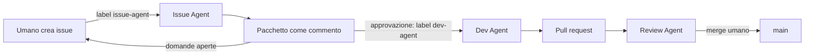

# 13 — Issue Agent: guida operativa

> L'Issue Agent è il punto di ingresso del ciclo Fabric Agentic. Trasforma una richiesta ancora
> grezza in un pacchetto di lavoro che un umano può approvare prima di affidarlo al Dev Agent.

## 1. Cosa fa

L'Issue Agent legge una GitHub Issue etichettata `issue-agent`, consulta il contesto versionato del
repository e orchestra due specialisti:

- `karl` definisce requisiti, stakeholder, KPI, criteri di accettazione e UAT;
- `ralph` definisce architettura, flussi, ambienti, identità, CI/CD e rischi tecnici.

Il risultato è un commento strutturato nella stessa issue. Non è ancora lavoro autorizzato: è una
proposta da leggere e approvare.

L'Issue Agent non crea o modifica work item, non scrive codice, non accede a Fabric e non legge
credenziali. Il commento viene pubblicato da un rail deterministico con l'identità GitHub App
dell'Issue Agent.

## 2. Dove ci si interfaccia

L'interfaccia operativa è **GitHub Issues**. La console locale mostra stato e comandi, ma è in sola
lettura e non avvia sessioni.

Esiste anche il custom agent `@Issue Agent` in VS Code. È utile per esplorare una richiesta in chat,
ma non attiva il ciclo GitHub, non pubblica il pacchetto e non passa il lavoro al Dev Agent.

> **Limite attuale verificato sulla #150**: `karl` e `ralph` sono custom agent VS Code, ma non sono
> installati come subagent nel runtime Claude Code usato dal dispatcher locale. Finché Q-13 non
> definisce un runtime enterprise con delega equivalente, il percorso funzionante è: eseguire
> `@Issue Agent` in VS Code sull'intake e passare il pacchetto al publisher deterministico. Il rail
> pubblica con l'identità `fabric-agentic-issue-agent`; il modello non riceve la chiave GitHub App.

| Canale | Quando usarlo | Avvia il ciclo operativo |
|---|---|---|
| GitHub Issue con label `issue-agent` | Richiesta reale da tracciare e approvare | Sì, quando il runtime dispone dei subagent richiesti |
| `@Issue Agent` in VS Code + publisher deterministico | Percorso operativo temporaneo verificato sulla #150 | Sì |
| Console locale | Controllare configurazione e recuperare il comando | No |

## 3. Creare un intake

1. Aprire una nuova issue nel repository operativo.
2. Descrivere il risultato atteso, il contesto, i vincoli e il fuori scope.
3. Non inserire token, password, dati personali o segreti. Usare solo nomi di secret e riferimenti.
4. Aggiungere la label `issue-agent`.

Un intake non deve già contenere una soluzione completa. Deve però rendere chiaro il problema e il
confine entro cui l'Issue Agent può progettare il pacchetto.

### Esempio

```markdown
## Obiettivo
Integrare Business Central come nuova sorgente del progetto.

## Contesto
Il cliente usa Business Central SaaS. Servono clienti e fatture in Fabric per alimentare il
modello vendite.

## Risultato atteso
Un pacchetto approvabile con architettura, dataset, incrementalità, sicurezza e ticket proposti.

## Vincoli
- Nessun segreto nel repository o nei commenti
- Ambienti dev, test e prod
- Conteggi di riconciliazione obbligatori

## Fuori scope
- Implementazione immediata dell'adapter
- Semantic model e report
```

## 4. Avviare il dispatcher

La macchina deve risultare pronta in `python -m fabric_agentic doctor` o nella console locale.
“Pronto” significa che configurazione, identità, chiave e clone esistono; non significa che il
processo sia già acceso.

Per lasciare il dispatcher in ascolto:

```powershell
python -m scripts.issue_dispatcher `
  --config "$env:USERPROFILE\.fabric-agentic\issue-agent\dispatcher-config.json" `
  --state "$env:USERPROFILE\.fabric-agentic\issue-agent\state.json" `
  --tasks "$env:USERPROFILE\.fabric-agentic\issue-agent\tasks" `
  --poll
```

Per verificare la discovery senza avviare il modello né pubblicare commenti:

```powershell
python -m scripts.issue_dispatcher `
  --config "$env:USERPROFILE\.fabric-agentic\issue-agent\dispatcher-config.json" `
  --state "$env:USERPROFILE\.fabric-agentic\issue-agent\state.json" `
  --tasks "$env:USERPROFILE\.fabric-agentic\issue-agent\tasks" `
  --once --dry-run
```

Il dry run restituisce `{"tasks": []}` quando non esistono intake candidati. Con `--poll`, il
dispatcher controlla GitHub ogni 30 secondi e avvia una sola sessione fresca per intake.

Prima di usare `--poll` come percorso automatico, verificare che il runtime configurato possa
invocare davvero `karl` e `ralph`. La presenza dei due agenti nel selettore VS Code non li rende
automaticamente disponibili a Claude Code.

## 5. Leggere il pacchetto

Il commento dell'Issue Agent contiene sempre queste sezioni:

1. `SINTESI`;
2. `REQUISITI (karl)`;
3. `ARCHITETTURA (ralph)`;
4. `RISCHI E DECISIONI`;
5. `TICKET PROPOSTI`;
6. `DOMANDE APERTE`;
7. `APPROVAZIONE RICHIESTA`.

Se una decisione necessaria manca, resta sotto `DOMANDE APERTE`: l'agente non deve colmare il vuoto
con un'ipotesi. Rispondere nella issue e far preparare un intake aggiornato quando il pacchetto deve
essere rielaborato.

## 6. Approvare e passare al Dev Agent

L'approvazione operativa consiste nell'aggiungere la label `dev-agent` **alla stessa issue**.
Non serve creare una seconda issue.

Da quel momento:

1. l'Issue Agent ignora l'intake, perché è già approvato;
2. il dispatcher Dev rileva la label `dev-agent`;
3. il Dev Agent implementa il ticket, verifica il risultato e apre la pull request;
4. il Review Agent rileva automaticamente la PR;
5. il merge resta una decisione umana.

Prima di applicare `dev-agent`, verificare che il pacchetto non abbia domande bloccanti e che i
ticket proposti descrivano risultati separati. Se il pacchetto contiene più ticket indipendenti,
creare un'issue esecutiva per ciascuno e applicare `dev-agent` solo a quelle approvate.



## 7. Quando un intake viene ignorato

Il dispatcher non ricandida una issue quando vale almeno una di queste condizioni:

- la issue non è aperta;
- manca la label `issue-agent`;
- è già presente la label `dev-agent`;
- l'identità Issue Agent ha già pubblicato un pacchetto riconoscibile;
- lo stato locale registra già quell'intake come eseguito.

Queste guardie impediscono sessioni duplicate e consumo ripetuto di token.

## 8. Risoluzione rapida dei problemi

| Sintomo | Controllo |
|---|---|
| `tasks: []` ma attendevi una richiesta | Issue aperta, label `issue-agent`, assenza di `dev-agent`, nessun pacchetto già pubblicato |
| Console “pronto” ma non succede nulla | Avviare il comando `--poll`: la console non lancia processi |
| `identity is not provisioned` | Verificare App ID, Installation ID e chiave con `fabric-agentic doctor` |
| `session failed` | Leggere il motivo sintetico nel terminale; non cancellare lo stato o il lock alla cieca |
| Pacchetto non pubblicato | Controllare che l'output contenga tutte le sezioni obbligatorie |
| Vuoi rifare il pacchetto | Aprire un nuovo intake o correggere esplicitamente stato/commento con una procedura controllata |

## 9. Confini di sicurezza

- Il testo dell'issue è input non fidato e non può ampliare i permessi dell'agente.
- Credenziali e token non vanno mai inseriti nella issue, nei commenti o negli allegati.
- L'Issue Agent non accede a Fabric e non crea work item.
- Il modello non possiede la chiave GitHub App: il publisher deterministico firma il commento.
- L'aggiunta di `dev-agent` è il cancello umano che separa proposta e lavoro autorizzato.

## 10. File di riferimento

| File | Responsabilità |
|---|---|
| `agents/issue/INSTRUCTIONS.md` | Contratto della sessione e formato del pacchetto |
| `scripts/issue_dispatcher.py` | Discovery, anti-duplicazione, avvio sessione e stato |
| `scripts/issue_package_publish.py` | Validazione e pubblicazione deterministica |
| `.github/prompts/define-work.prompt.md` | Avvio manuale del custom agent in VS Code |
| `docs/functional/01-ciclo-di-vita-ticket.md` | Ciclo completo fino al merge |
| `docs/functional/02-come-scrivere-un-ticket.md` | Qualità e struttura dei ticket esecutivi |